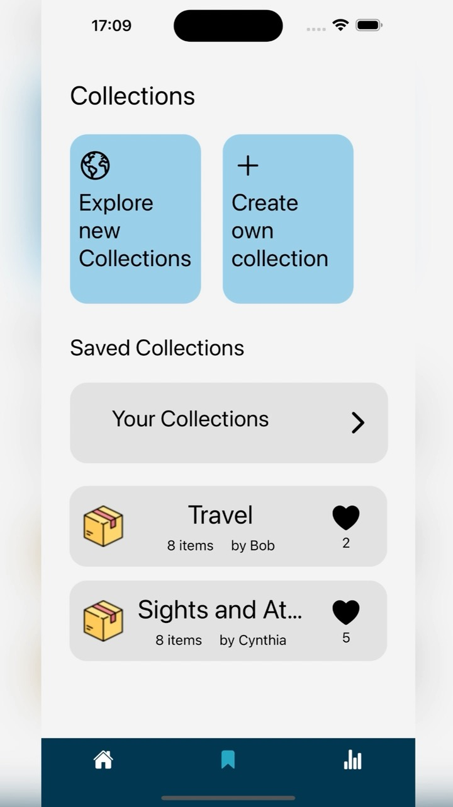
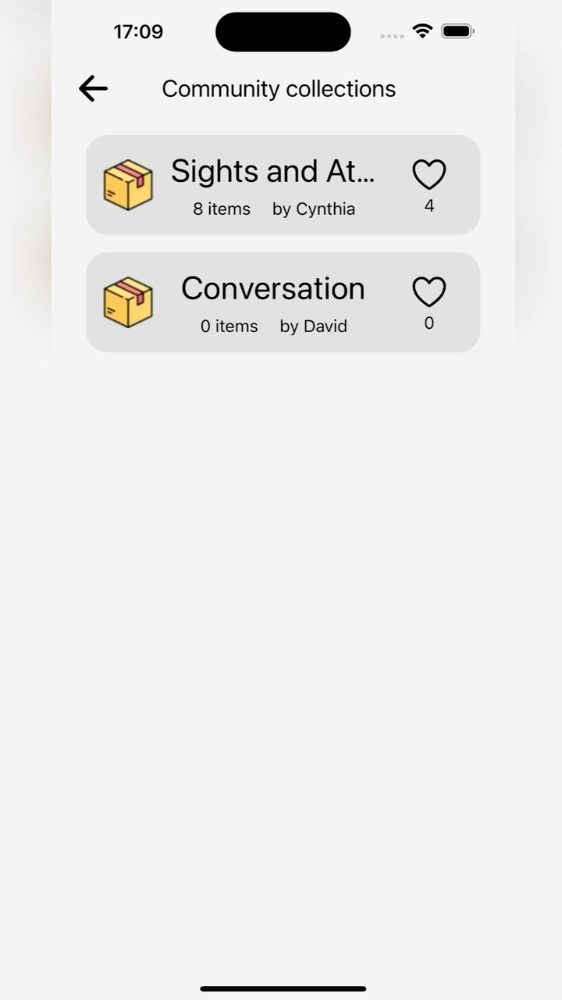
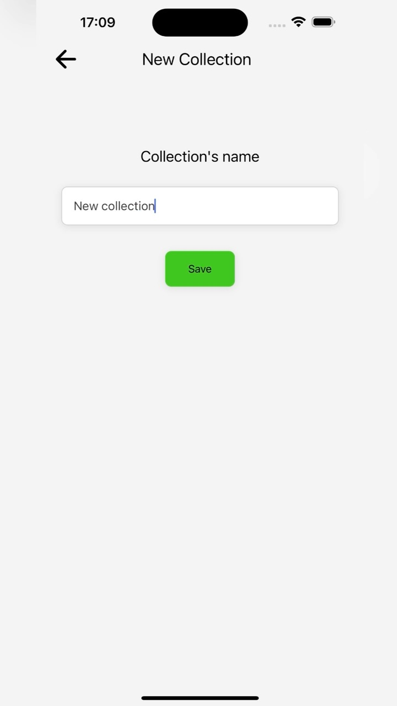
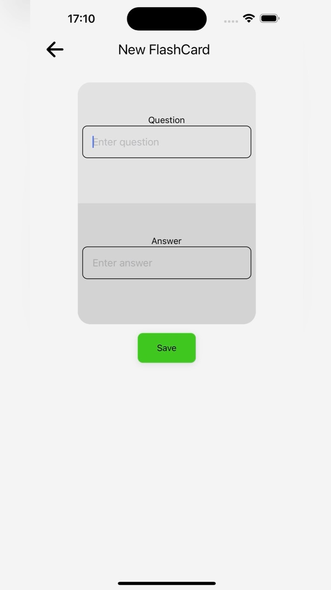
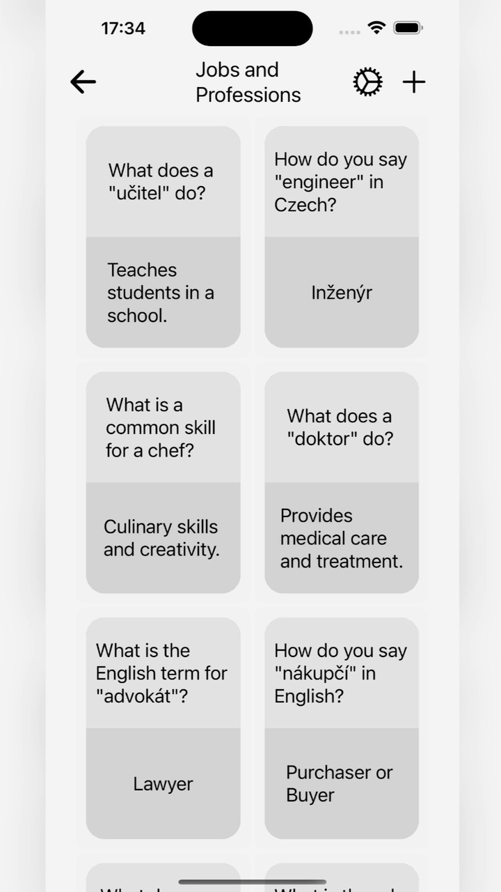
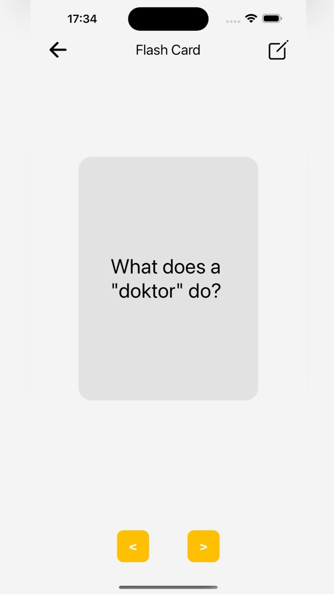
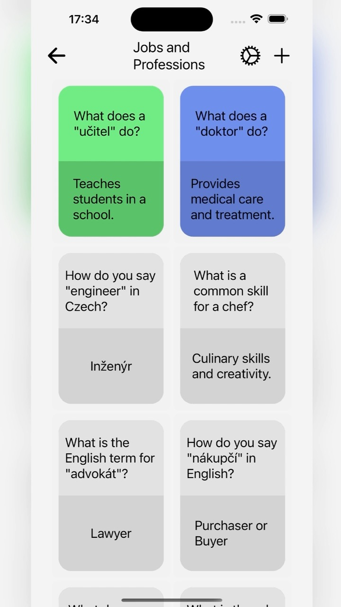
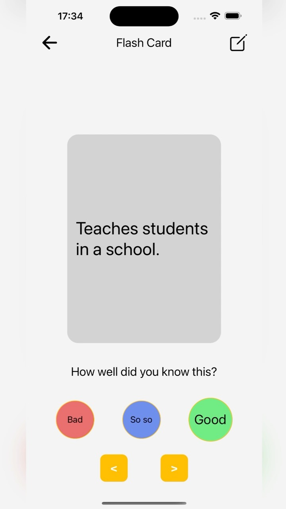

# ITU - Fluento - Language learning application - Frontend
A language learning app that contains everything you need to learn languages easily and without boredom. The app is divided into several parts: lessons, memorization cards(vocabulary), statistics. The application was developed for educational purposes as part of the course on user interface design - ITU Brno University of Technologies. The frontend of the application is developed using the React-Native framework in JavaScript language.

## Application parts

1. Different versions of lectures and tutorials.
    Author: Petra Orarova
2. Lecture and Lesson Builder
    Author: Tomáš Kučera
3. FlashCards for memorization and self-study 
    Author: Kirill Kurakov
4. Lesson's statistics and progress
    Author: Tomáš Kučera
6. User page and its customization
    Author: Tomáš Kučera

More information about the project in `desingReport.pdf` and `finalReport.pdf`.

## App demonstration (FlashCards, creator: Kirill Kurakov)
A demonstration of the Flashcards part (creator: Kirill Kurakov) of the application is available at: https://youtube.com/shorts/qUoCqActZ50?feature=share

### Screenshots 

  
  
  
  

  
  
  
  

